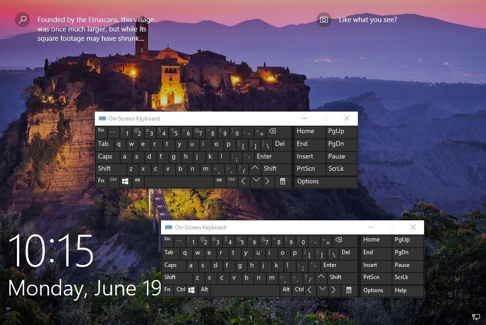

# FoodForThoughts
Unknown stuffs which I've encountered but have no time to investigate

## On-screen keyboard (OSK)
1. Did you know that if you open osk.exe and lock your screen (Win + L) or Start Menu > Lock, another osk.exe will spawn on the lock screen? The process of locking screen switches your desktop from Winsta0\Default to Winsta0\Disconnect. Somehow, the osk from Winsta0\Default is being brought to Winsta0\Disconnect. When you try to login by pressing any key, you will be brought to Winsta0\Winlogon. Once you are logged on, the same 2 OSK appears back on your Winsta0\Default desktop. Both OSK is in Medium+ integrity (somehow!) and there was no priv escalation opportunity, unless we are able to somehow reverse this process (i.e., spawn System Priv OSK in Winsta0\Winlogon ak.a. Secure Desktop and when we login, the OSK running with System priv is being brought into Winsta0\Default)(?). If you use procmon, you can somehow see a system priv OSK spawnning, but no where to be seen! Also, if you were to spawn OSK with SYSTEM priv, you will notice the "HELP" button on the OSK disappear, which the coincidentally disappeared on our 2nd OSK that spawned in Winsta0\Disconnect too! Was there some kind of down-priv somewhere? Doesn't seemed like it when I study the procmon logs, but I might be wrong. Was wondering if this is because osk and UiAccess + always on top enabled, but that seems to be not the case. I've created a simple app with UiAccess + Always on top, but that app does not get brought to the Winsta0\Disconnect desktop upon locking the screen.

2. Did you know that if you were to launch osk from cmd, your osk will also try to search for wdmaud.drv (Winmm  audio system driver) from the current directory (in cmd) that you launched osk? Although it successfully loaded from C:\Windows\System32. All these are loaded through current logon user's privilege and not SYSTEM, but it makes me wonder what happens in the background when you load .drv file as a normal user. Any chance of privilege escalation? The original wdmaud.drv is digitally signed (verify via sigcheck) but is it mandatory for .drv files to be digitally signed before loading? Was thinking if we can have the opportunity to load our custom .drv file to see if we can make some magic happen🥴

